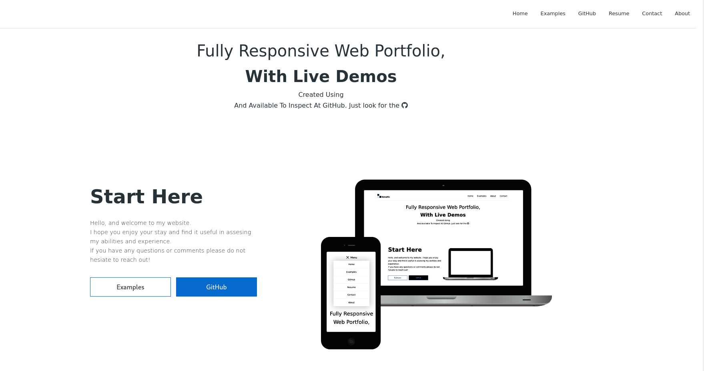

# Portfolio website

---

## Live preview available [here](http://sonatic.dev)

### Setup methodolgy thanks to [Stephanie Eckles](https://thinkdobecreate.com/articles/minimum-static-site-sass-setup) via [Kevin Powell](https://www.kevinpowell.co)

## Objective

## Sass methodology

I began with one main scss file and two partials:
\_config containing my variables
\_media with media queries and breakpoint settings

As I progressed, keeping the code organised became more difficult and making small ajustments more tedious so I decided to implement a more elaborate folder structure to keep everything well labled and accessable.

### Folder structure

### Variable names

I decided to use CSS custom properties rather than sass variables. One, because of their ability to be manipulated with JavaScript (which would be very useful if I decided to implement a toggleable dark mode) and for the color previews available in vscode with autocomplete

Here is what I ended up with for color variables

#### Theme selection

t = theme

a = default  
b = alt  
z = alt:2

#### Theme variation

p = primary  
s = secondary  
l = light  
d = dark

#### Variable type

c = color  
f = font  
s = size

#### Variation

numbers 1-5 or more if needed

---

Thus, the first three letter represent the higher order application:

cta = color-theme-default
ctb = color-theme-alt

The second three letters represent the specifics

ftd = font-dark  
ctz-ftd = color-theme-alt:2-

The last number can represent a step in variation in which the base increases intensity by number. For example light 1 is the darkest shade and lightness intensifies as the numbers increase. Likewise darkness increases as the numbers increase, as does size.

cta-dshade-1 = color-theme-default-dark-shade-1 (least dark shade)
cta-lshade-1 = color-theme-default-light-shade-1 (least light shade)

--

```c

    // Color theme = ct

    // Brand = br
    --cta-brp: #076acd;
    --cta-brs: #539cdf;

    // Font = ft
    --cta-ftd: #29353b;
    --cta-ftl: hsl(0, 0%, 99)

    // Background = bg
    --cta-bg: #fff;
    --cta-bgp: #d9f4ff;
    --cta-bgs: var(--lshade-5);

    // logo
    --cta-plogo: #0066cc;
    --cat-llogo: #cfd8dc;
    --cta-dlogo: #29353b;

    // Black, white, gray
    --blk: #000;
    --wht: #fff;
    --gry: #333;

    // light-shades
    --lshade-1: hsl(0, 0%, 70%);
    --lshade-2: hsl(0, 0%, 87%);
    --lshade-3: hsl(0, 0%, 90%);
    --lshade-4: hsl(0, 0%, 95%);
    --lshade-5: hsl(0, 0%, 97%);

    // test colors for production
    --ts-red: red;
    --rs-blu'''csse: blue;
```
